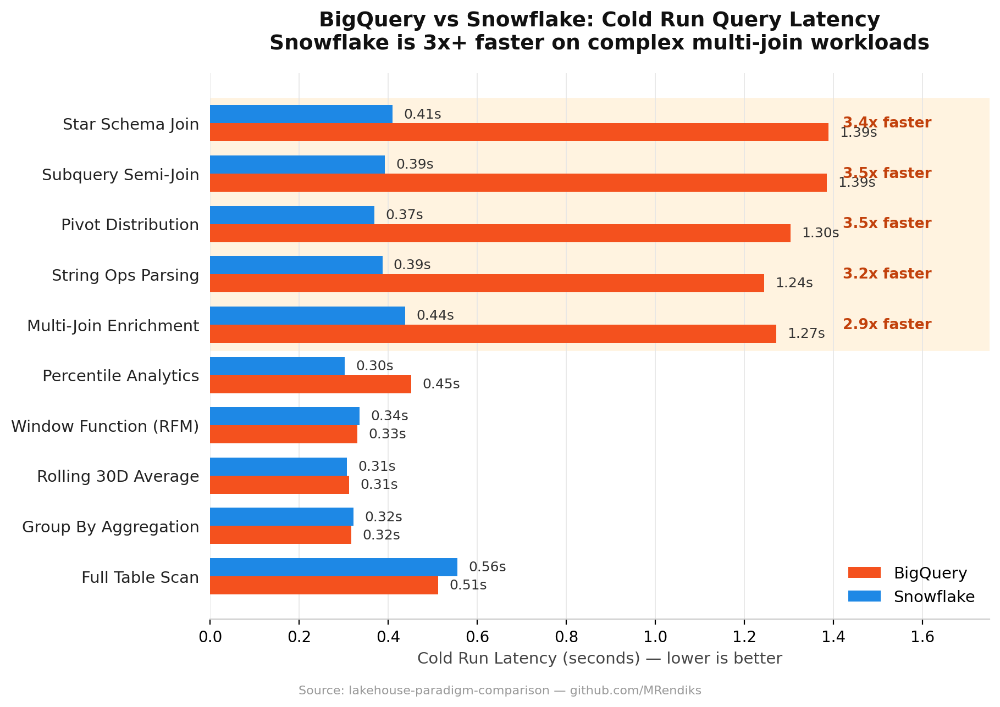
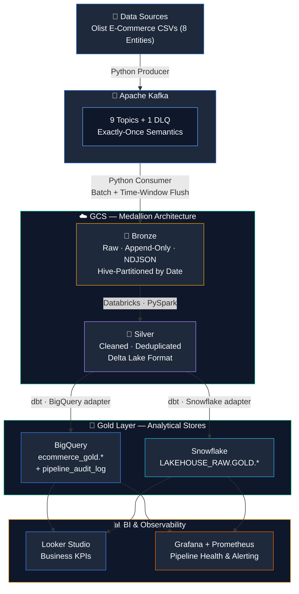
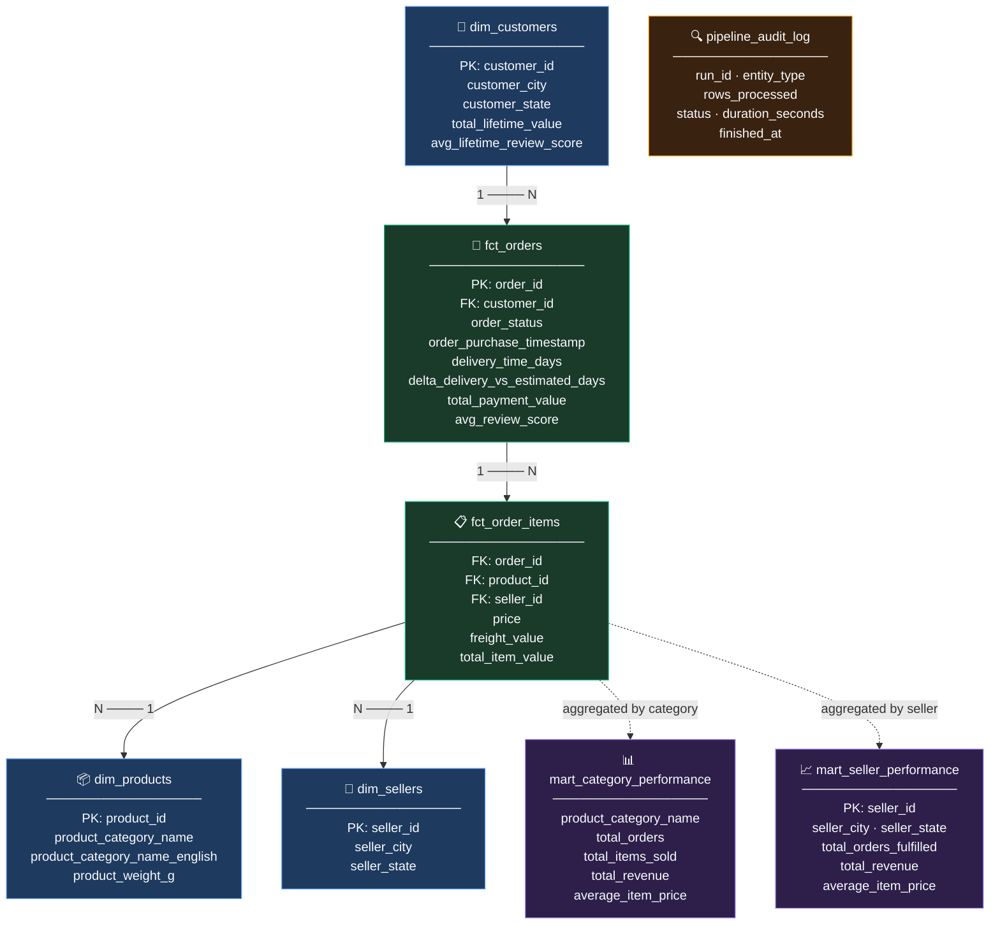

# Lakehouse Paradigm Comparison

> A production-grade, end-to-end Data Engineering portfolio project benchmarking **Google BigQuery** and **Snowflake** as Lakehouse paradigms, built on a unified GCS-backed Medallion Architecture (Bronze → Silver → Gold) with full observability, data quality enforcement, and a live BI dashboard.

[](https://python.org) [](https://docs.getdbt.com) [](https://cloud.google.com/bigquery) [](https://snowflake.com) [](https://terraform.io) [](https://kafka.apache.org) [](https://grafana.com)

---

## Table of Contents

- [Key Findings — BigQuery vs Snowflake](#-key-findings--bigquery-vs-snowflake)
- [Architecture Overview](#architecture-overview)
- [Tech Stack](#tech-stack)
- [Project Structure](#project-structure)
- [Data Model](#data-model)
- [Getting Started](#getting-started)
  - [1. Prerequisites](#1-prerequisites)
  - [2. GCP Authentication](#2-authenticate-with-google-cloud)
  - [3. Provision GCP Infrastructure](#3-provision-gcp-infrastructure-terraform)
  - [4. Provision Databricks Secrets](#4-provision-databricks-secrets-terraform)
  - [5. Provision Snowflake Infrastructure](#5-provision-snowflake-infrastructure-terraform)
  - [6. Setup Local Kafka](#6-setup-local-kafka-docker)
  - [7. Setup Python Environment](#7-setup-python-environment)
  - [8. Run the Kafka Producer](#8-run-the-kafka-producer)
  - [9. Run the Consumer](#9-run-the-consumer-kafka--gcs-bronze)
  - [10. Run dbt Transformations](#10-run-dbt-transformations)
  - [11. Run the Performance Benchmark](#11-run-the-performance-benchmark)
  - [12. Observability & Monitoring](#12-observability--monitoring)
- [Kafka Topics](#kafka-topics)
- [Design Decisions](#design-decisions)

---

## 🔑 Key Findings — BigQuery vs Snowflake

### ⚡ Snowflake is ~3× faster for complex multi-join queries

Across 10 benchmark workloads over the same Delta Lake dataset on GCS, Snowflake consistently outperformed BigQuery on join-heavy analytical patterns:

| Query Pattern | BigQuery | Snowflake | Delta |
|---|---|---|---|
| `multi_join_enrichment` | 1.271s | 0.438s | **2.9× faster** |
| `subquery_semi_join` | 1.385s | 0.393s | **3.5× faster** |
| `pivot_distribution` | 1.303s | 0.369s | **3.5× faster** |
| `star_schema_join` (5 tables) | 1.389s | 0.410s | **3.4× faster** |

Snowflake's virtual warehouse clustering and local SSD cache give it a decisive edge when queries span multiple large tables. For continuous production pipelines with heavy transforms, this adds up to significant wall-clock savings.



> **Takeaway:** Choose **Snowflake** for high-throughput, join-heavy production pipelines.

### 💸 BigQuery is dramatically cheaper for ad-hoc, low-frequency queries

The two platforms operate on fundamentally different billing models:

| | BigQuery | Snowflake |
|---|---|---|
| **Billing model** | Pay-per-scan ($5.00/TB) | Pay-per-compute-time (~$3.00/credit-hr) |
| **Idle cost** | **$0** (serverless) | Warehouse stays active, consuming credits |
| **Best for** | Ad-hoc analytics, sporadic queries | Continuous pipelines, predictable workloads |

For the Olist dataset (~100K rows), a single BigQuery query costs **~$0.0001** while Snowflake's minimum 60-second warehouse billing cycle makes the same query materially more expensive when run in isolation.

> **Takeaway:** Choose **BigQuery** for ad-hoc analytics, data exploration, and low-frequency reporting where idle time dominates.

### 🔧 Solved a real-world Delta Lake cross-platform compatibility bug

BigQuery and Snowflake expose Delta Lake external tables in **fundamentally different ways** — a rarely documented gap that breaks portability:

| | BigQuery | Snowflake |
|---|---|---|
| **Delta Lake support** | Native — parses schema & exposes each column as a first-class field | Exposes all rows inside a single `VALUE` column of type `VARIANT` |
| **Query syntax** | `SELECT order_id FROM orders` | `SELECT value:order_id FROM orders` |

**The fix:** A custom dbt `{{ col() }}` macro that detects the active warehouse at runtime and emits the correct column accessor — making a **single dbt codebase run identically on both platforms** with zero manual intervention:

```sql
-- BigQuery target →   safe_cast(order_id as string)
-- Snowflake target →  cast(value:order_id as string)
{{ col('order_id') }}
```

This is the kind of edge case you only discover by building — not by reading docs. It demonstrates the real-world complexity of maintaining a truly multi-platform lakehouse.

> **Takeaway:** Cross-platform portability is achievable, but requires warehouse-aware abstraction layers. A single `profiles.yml` switch is not enough.

📄 Full benchmark methodology, all 10 query results, and cost analysis → **[BENCHMARK_REPORT.md](./BENCHMARK_REPORT.md)**


## Architecture Overview



---

## Tech Stack

| Layer | Tool | Purpose |
|---|---|---|
| **Infrastructure** | Terraform | GCS Buckets, BigQuery, Snowflake, IAM, Databricks Secrets |
| **Secret Management** | Infisical Cloud | Centralized secrets (Kafka, GCP, Snowflake) |
| **Message Broker** | Apache Kafka (Docker) | Per-entity topic streaming with DLQ |
| **Ingestion** | Python + `confluent-kafka` | Producer (CSV→Kafka) & Consumer (Kafka→GCS) |
| **Processing** | Databricks (Serverless) + PySpark | Bronze→Silver transformation with Delta Lake |
| **Transformation** | dbt Core | Silver→Gold SQL models (BigQuery + Snowflake) |
| **Data Quality** | dbt tests + Elementary | Schema contracts, `not_null`, `unique`, `relationships` |
| **Analytical Store** | Google BigQuery | Gold layer for GCP paradigm |
| **Analytical Store** | Snowflake | Gold layer for cross-cloud paradigm |
| **Observability** | Grafana + Prometheus | Pipeline health metrics & alerting |
| **BI Dashboard** | Looker Studio | Business KPI dashboards from Gold layer |
| **Package Manager** | `uv` + `hatchling` | Fast, modern Python dependency management |
| **CI/CD** | GitHub Actions | Terraform fmt/validate + Ruff lint + pytest |

---

## Project Structure

```
lakehouse-paradigm-comparison/
├── .gitignore
├── README.md
├── BENCHMARK_REPORT.md             # Auto-generated benchmark results
├── docker-compose.yaml             # Kafka + Kafka-UI (local dev)
├── contracts/
│   └── order_contract.yaml         # Data contract definition (schema enforcement)
├── scripts/
│   ├── auth-setup.sh               # gcloud ADC authentication helper
│   └── setup-minikube.sh           # Kafka on local K8s (optional)
├── infrastructure/
│   ├── gcp/                        # Terraform: GCS, BigQuery, IAM
│   │   ├── providers.tf
│   │   ├── main.tf                 # GCS Buckets (Bronze, Silver, Gold)
│   │   ├── bigquery.tf             # BigQuery Dataset & Tables
│   │   ├── iam.tf                  # IAM roles for Snowflake & Databricks
│   │   ├── variables.tf
│   │   ├── outputs.tf
│   │   ├── terraform.tfvars        # ⚠️ Not committed to Git
│   │   └── terraform.tfvars.example
│   ├── databricks/                 # Terraform: Databricks Secret Scope
│   │   ├── providers.tf
│   │   ├── secrets.tf              # Secret Scope + GCP SA key injection
│   │   ├── variables.tf
│   │   ├── outputs.tf
│   │   ├── terraform.tfvars        # ⚠️ Not committed to Git
│   │   └── terraform.tfvars.example
│   └── snowflake/                  # Terraform: Snowflake DB + Stage + GCS Handshake
│       ├── providers.tf            # Snowflake + Google dual provider
│       ├── database.tf             # Database LAKEHOUSE_RAW + Schemas + Warehouse
│       ├── storage.tf              # Storage Integration + Auto GCP IAM + Stage
│       ├── variables.tf
│       ├── outputs.tf
│       ├── terraform.tfvars        # ⚠️ Not committed to Git
│       └── terraform.tfvars.example
├── ingestion/                      # Python Ingestion Engine (uv project)
│   ├── .env                        # ⚠️ Not committed to Git
│   ├── .env.example                # Configuration template
│   ├── pyproject.toml              # Project metadata + dependencies
│   └── source/
│       ├── main.py                 # CLI entry point (Typer)
│       ├── config/
│       │   └── settings.py         # Pydantic BaseSettings
│       ├── controller/
│       │   ├── producer.py         # CLI: batch / single-file producer
│       │   └── consumer_to_gcs.py  # CLI: stream / stream-all consumer
│       ├── services/
│       │   ├── infisical_manager.py # Infisical SDK secret loader
│       │   ├── kafka_svc.py        # Kafka base client (confluent-kafka)
│       │   ├── kafka_producer_svc.py # CSV → EventEnvelope → Kafka
│       │   ├── kafka_consumer_svc.py # Kafka → GCS (batch + time flush)
│       │   └── storage_svc.py      # GCS / S3 / ADLS adapter (ABC)
│       ├── mapper/
│       │   └── configs/
│       │       └── topic_map.py    # DATASET_TOPIC_MAP (filename → topic)
│       ├── core/
│       │   ├── constants.py        # Enums: Topics, Layers
│       │   └── exceptions.py       # Custom pipeline exceptions
│       └── models/
│           └── event_envelope.py   # EventEnvelope data contract model
├── processing/
│   └── databricks/
│       └── bronze_to_silver.py     # PySpark: Bronze NDJSON → Silver Delta
├── transformation/
│   └── dbt_project/
│       ├── dbt_project.yml
│       ├── profiles.yml            # BigQuery + Snowflake targets
│       ├── packages.yml            # dbt-utils + elementary
│       ├── run_dbt_infisical.py    # Infisical-powered dbt runner
│       ├── benchmark.py            # Dual-paradigm query benchmark script
│       ├── models/
│       │   ├── staging/            # stg_orders, stg_customers, ...
│       │   ├── intermediate/       # int_orders_enriched, ...
│       │   └── marts/              # fct_orders, dim_customers, mart_*
│       ├── macros/
│       │   └── col.sql             # Cross-warehouse column accessor macro
│       └── tests/
├── monitoring/
│   ├── prometheus.yml              # Prometheus scrape config
│   ├── alert_rules.yml             # Alerting rules (pipeline lag, errors)
│   └── grafana/
│       └── dashboards/             # Grafana dashboard JSON exports
└── .github/
    └── workflows/
        ├── terraform-ci.yml        # Terraform fmt + validate on PR
        └── python-ci.yml           # Ruff lint + pytest on PR
```

---

## Data Model

The Gold Layer follows a **Star Schema** pattern optimized for analytical queries on BigQuery and Snowflake.



---

## Getting Started

### 1. Prerequisites

| Tool | Version | Install |
|---|---|---|
| Google Cloud SDK | latest | [cloud.google.com/sdk](https://cloud.google.com/sdk/docs/install) |
| Terraform | ≥ 1.5 | [developer.hashicorp.com/terraform](https://developer.hashicorp.com/terraform/downloads) |
| Python | ≥ 3.10 | [python.org](https://www.python.org/downloads/) |
| uv | latest | `pip install uv` |
| Docker Desktop | latest | [docker.com](https://www.docker.com/products/docker-desktop/) |

### 2. Authenticate with Google Cloud

```bash
gcloud auth login
gcloud auth application-default login
```

This sets up **Application Default Credentials (ADC)** used by both Terraform and the Python ingestion engine for keyless authentication.

### 3. Provision GCP Infrastructure (Terraform)

```bash
cd infrastructure/gcp
cp terraform.tfvars.example terraform.tfvars
# Edit terraform.tfvars: set your project_id and region

terraform init
terraform plan
terraform apply
```

This provisions: GCS Buckets (bronze, silver, gold), BigQuery Dataset (`ecommerce_gold`), and IAM roles.

### 4. Provision Databricks Secrets (Terraform)

```bash
cd infrastructure/databricks
cp terraform.tfvars.example terraform.tfvars
# Edit terraform.tfvars: set databricks_host, token, and GCP SA key path

terraform init
terraform apply
```

This creates a `gcp_secrets` Secret Scope in your Databricks Workspace and injects the GCP Service Account key — no manual copy-paste required.

### 5. Provision Snowflake Infrastructure (Terraform)

Get your Snowflake org and account name by running these queries in a Snowflake Worksheet:

```sql
SELECT CURRENT_ORGANIZATION_NAME();
SELECT CURRENT_ACCOUNT_NAME();
```

Then:

```bash
cd infrastructure/snowflake
cp terraform.tfvars.example terraform.tfvars
# Edit terraform.tfvars: set snowflake credentials and GCP project/bucket

terraform init
terraform apply
```

This provisions in a **single `terraform apply`**:
- Snowflake Database `LAKEHOUSE_RAW` + Schemas (`BRONZE`, `SILVER`, `GOLD`)
- Virtual Warehouse `LAKEHOUSE_WH` (X-SMALL, auto-suspend 60s)
- Storage Integration `GCS_INT` linking GCS ↔ Snowflake
- **GCP IAM binding is applied automatically** (no manual GCP Console step!)
- External Stage `GCS_BRONZE_STAGE` ready to query

Verify by running in Snowflake Worksheet:

```sql
LIST @LAKEHOUSE_RAW.BRONZE.GCS_BRONZE_STAGE;
```

### 6. Setup Local Kafka (Docker)

```bash
# From the project root
docker compose up -d

# Verify Kafka is running
# Kafka Broker: localhost:9092
# Kafka UI:     http://localhost:8080
```

### 7. Setup Python Environment

```bash
cd ingestion
uv sync
```

Copy the environment template and fill in your credentials (Infisical Machine ID/Secret from your Infisical project):

```bash
cp .env.example .env
# Edit .env with your Infisical credentials
```

> **Note:** `GCS_BRONZE_BUCKET` in `.env` is auto-picked up by the consumer — no need to pass `--bucket` on every command.

### 8. Run the Kafka Producer

Produces all 8 Olist CSV datasets to their respective Kafka topics:

```bash
cd ingestion

# Batch mode: produce all CSVs from a directory
uv run ingestion-run producer batch --data-dir /path/to/olist/data --env dev

# Single file mode
uv run ingestion-run producer single-file --filename olist_orders_dataset.csv --data-dir /path/to/olist/data
```

### 9. Run the Consumer (Kafka → GCS Bronze)

**Local development** — stream all topics concurrently (one thread per topic):

```bash
uv run ingestion-run consumer-to-gcs stream-all --env dev
```

**Production / Kubernetes** — one isolated pod per topic for full observability:

```bash
# Pattern (replace --entity, --topic, --group-id per entity):
uv run ingestion-run consumer-to-gcs stream \
  --topic ecommerce.olist.<entity>.v1 \
  --entity <entity> \
  --group-id gcs-bronze-<entity>-dev-v0.0.1 \
  --batch-size 1000
```

See [Kafka Topics](#kafka-topics) for the full topic → entity mapping table.

> **Consumer Design:** Uploads are triggered when **either** the batch reaches `--batch-size` records **or** 30 seconds have elapsed (time-window flush), ensuring near-real-time latency without small-file explosion.

---

### 10. Run dbt Transformations

Navigate to the dbt project directory first:

```bash
cd transformation/dbt_project
```

#### 10a. BigQuery Execution

BigQuery external tables are fully managed via Terraform. No manual table initialization is required.

```bash
# Run the dbt models to materialize Gold tables in ecommerce_gold
uv run dbt run --profiles-dir . --target bigquery

# Run data quality tests (not_null, unique, accepted_values, relationships)
uv run dbt test --profiles-dir . --target bigquery
```

#### 10b. Snowflake Execution

Snowflake external tables must be registered over the GCS Silver stage before executing models.

```bash
# Set Snowflake authentication environment variables
$env:SNOWFLAKE_ACCOUNT="<YOUR_SNOWFLAKE_ACCOUNT>"
$env:SNOWFLAKE_USER="<YOUR_SNOWFLAKE_USER>"
$env:SNOWFLAKE_PASSWORD="<YOUR_SNOWFLAKE_PASSWORD>"

# Initialize/recreate Snowflake external tables over Delta GCS stage
uv run dbt run-operation create_external_tables --profiles-dir . --target snowflake

# Run dbt models to materialize Gold tables in the GOLD schema
uv run dbt run --profiles-dir . --target snowflake

# Run data quality tests
uv run dbt test --profiles-dir . --target snowflake
```

#### 10c. Snowflake via Infisical (Recommended for Teams)

A custom Python runner `run_dbt_infisical.py` automatically loads credentials from Infisical Cloud — no manual `$env:` variable setting required:

```bash
# From: transformation/dbt_project

# Run dbt models securely via Infisical secrets
uv run python run_dbt_infisical.py run --profiles-dir . --target snowflake

# Run data quality tests securely via Infisical secrets
uv run python run_dbt_infisical.py test --profiles-dir . --target snowflake

# Register external tables via Infisical secrets
uv run python run_dbt_infisical.py run-operation create_external_tables --profiles-dir . --target snowflake
```

#### 10d. Generate Interactive Documentation & Lineage Graph

```bash
# Generate the documentation manifest
uv run dbt docs generate --profiles-dir .

# Start the interactive documentation server (default port 8080)
uv run dbt docs serve --profiles-dir . --port 8085
```

Open `http://localhost:8085` to explore table descriptions, schemas, tests, and the interactive lineage DAG.

---

### 11. Run the Performance Benchmark

Executes an automated dual-paradigm benchmark comparing BigQuery and Snowflake over 10 distinct analytical workloads:

```bash
cd transformation/dbt_project

# Connects to both warehouses, runs 10 queries, outputs a markdown report
uv run python benchmark.py
```

The script measures **Cold Run Latency** vs. **Warm Run Latency** for:

1. `fct_orders` Full Scan
2. Group By Aggregation (Customer LTV)
3. Multi-Table Join Enrichment
4. Window Function (Customer RFM Analysis)
5. Complex Subquery Semi-Joins
6. Rolling 30-Day Moving Average
7. High-Cardinality String Parsing
8. Complex Pivot Cross-Tabulation
9. Star Schema Join Reconstruction
10. Heavy Mathematical Percentiles & Median

Results are compiled in [BENCHMARK_REPORT.md](./BENCHMARK_REPORT.md).

---

### 12. Observability & Monitoring

This project includes a full observability stack covering both **pipeline health** (Grafana) and **dbt data quality** (Elementary).

#### 12a. Grafana + Prometheus (Pipeline Health)

```bash
# From the project root — start observability stack
docker compose up -d

# Access dashboards:
# Grafana:    http://localhost:3000  (admin / admin)
# Prometheus: http://localhost:9090
```

Grafana dashboards monitor:
- **Kafka Consumer Lag** — detect stalled consumers per topic
- **Pipeline Throughput** — rows processed per hour per entity
- **Pipeline Audit Log** — ETL run success/failure rates from `ecommerce_gold.pipeline_audit_log`
- **Alerting** — Prometheus alert rules for lag > threshold

#### 12b. Elementary (dbt Data Observability)

[Elementary](https://docs.elementary-data.com/) is integrated as a dbt package and tracks data quality over time:

```bash
cd transformation/dbt_project

# Run Elementary report after dbt run
uv run edr report

# Or send to a Slack channel (if configured)
uv run edr send-report --slack-token <TOKEN> --slack-channel-name <CHANNEL>
```

---

## Kafka Topics

| Topic | Entity | Group ID Pattern |
|---|---|---|
| `ecommerce.olist.orders.v1` | `order` | `gcs-bronze-order-{env}-{version}` |
| `ecommerce.olist.order-items.v1` | `order_item` | `gcs-bronze-order-item-{env}-{version}` |
| `ecommerce.olist.payments.v1` | `payment` | `gcs-bronze-payment-{env}-{version}` |
| `ecommerce.olist.reviews.v1` | `review` | `gcs-bronze-review-{env}-{version}` |
| `ecommerce.olist.customers.v1` | `customer` | `gcs-bronze-customer-{env}-{version}` |
| `ecommerce.olist.products.v1` | `product` | `gcs-bronze-product-{env}-{version}` |
| `ecommerce.olist.product-categories.v1` | `product_category` | `gcs-bronze-product-category-{env}-{version}` |
| `ecommerce.olist.sellers.v1` | `seller` | `gcs-bronze-seller-{env}-{version}` |
| `ecommerce.olist.geolocation.v1` | `geolocation` | `gcs-bronze-geolocation-{env}-{version}` |
| `ecommerce.dlq.v1` | *(Dead Letter Queue)* | — |

> **Group ID versioning:** Bumping the version suffix (e.g. `v0.0.1` → `v0.0.2`) resets the consumer offset, allowing full historical replay without touching Kubernetes manifests.

---

## Design Decisions

### Why per-topic consumer pods (not one consumer for all)?
Each Kafka topic maps to one isolated consumer pod in Kubernetes. This provides:
- **Independent log streams** per entity (no mixed logs)
- **Individual resource limits & restart policies** per consumer
- **Granular scaling** — high-volume topics (orders) can scale independently

### Why batch-size + time-window flush?
Pure count-based batching leaves data stranded in memory during low-traffic periods. The dual-trigger strategy (`--batch-size` OR 30-second timeout) ensures:
- **Near-real-time latency** (max 30 seconds end-to-end)
- **No small-file problem** (files are always ≥ 1 record, optimally ~1000)

### Why Terraform for Databricks secrets?
The `infrastructure/databricks/` module treats Databricks Secret Scopes as Infrastructure as Code — reproducible, auditable, and GitOps-compliant. No manual UI clicks or ad-hoc scripts required in production.

### Why Bronze is append-only (no deduplication at GCS)?
Bronze is the **immutable raw history** of all events. Deduplication happens in the Silver layer via Spark `MERGE` (Delta Lake UPSERT), which is the standard Medallion Architecture pattern used at companies like Uber, Airbnb, and Gojek.

### Phase 6: Dual-Paradigm dbt Strategy & Lessons Learned

The full Delta Lake cross-platform compatibility analysis is covered in **[Key Findings — Delta Lake Compatibility](#-solved-a-real-world-delta-lake-cross-platform-compatibility-bug)**. Additional lessons from Phase 6:

1. **External Table Paradigm Mismatch:** See Key Finding #3 above for the full breakdown, including the custom `{{ col() }}` macro solution.

2. **Reserved Keywords & Case-Sensitivity (Snowflake):**
   - `ORDER` is a reserved SQL keyword. Snowflake requires explicit quoting: `LAKEHOUSE_RAW.SILVER."ORDER"`.
   - In `sources.yml`, we configured `quoting: { identifier: true }` for the `ORDER` source table.

3. **Snowflake Delta Lake External Table Properties:**
   - `AUTO_REFRESH = false` is mandatory — Delta Lake external tables don't support automated cloud messaging refresh.
   - `REFRESH_ON_CREATE = false` instructs Snowflake to query `_delta_log/` dynamically at query-time.
   - The `INTEGRATION` property at table level is redundant; it is inherited from the parent stage.

---

## License

This project is licensed under the MIT License - see the [LICENSE](LICENSE) file for details.

This project is part of a personal Data Engineering portfolio. Feel free to use it as a reference or learning resource.
